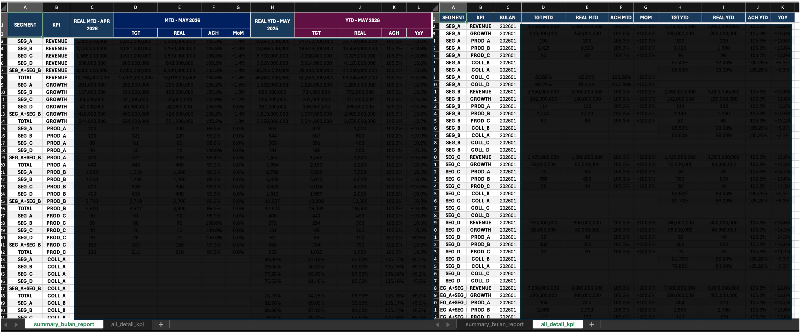

# KPI Validator

> Pipeline pelaporan KPI otomatis berbasis config, dibangun dengan Python dan pandas — mengagregasi data multi-sumber, menghitung metrik antar-periode, dan menghasilkan laporan Excel terformat.

[English](README.md) | **Bahasa Indonesia**

[](https://www.python.org/)
[](https://pandas.pydata.org/)
[](LICENSE)
[]()

---

## Daftar Isi

- [Overview](#overview)
- [Tech Stack](#tech-stack)
- [Arsitektur](#arsitektur)
- [Cakupan KPI](#cakupan-kpi)
- [Key Highlights](#key-highlights)
- [Contoh Output](#contoh-output)
- [Atribusi](#atribusi)
- [Cara Memulai](#cara-memulai)
- [Tentang Project](#tentang-project)
- [Lisensi](#lisensi)

---

## Overview

**KPI Validator** mengotomatiskan alur pelaporan KPI bulanan untuk sebuah unit bisnis telekomunikasi. Proses manual yang rawan error — mengonsolidasikan spreadsheet dari berbagai sumber data — dipangkas menjadi satu perintah yang memvalidasi input, menghitung seluruh rangkaian metrik, dan mengekspor workbook Excel terformat yang siap dipresentasikan.

Pipeline ini menangani **4 keluarga KPI di 4 segmen bisnis**, menghitung metrik month-to-date (MtD), year-to-date (YtD), achievement-vs-target, month-over-month (MoM), dan year-over-year (YoY) — lengkap dengan penanganan data yang hilang, cut-off date, dan proyeksi outlook.

> **Catatan** — Ini adalah versi portfolio publik. Semua identitas perusahaan, brand, produk, dan segmentasi telah diganti dengan placeholder generik. Logika kalkulasi dan arsitektur tidak berubah.

---

## Tech Stack

- **Python 3.11**
- **pandas** — manipulasi & agregasi data
- **openpyxl** — pembuatan & formatting Excel
- **xlrd** — dukungan baca Excel legacy

---

## Arsitektur

Pipeline berjalan sebagai **alur 5 langkah** yang deterministik:

```
┌─────────────┐   ┌─────────────┐   ┌─────────────┐   ┌─────────────┐   ┌─────────────┐
│  1.VALIDATE │ → │  2. INPUT   │ → │ 3. PROCESS  │ → │4. AGGREGATE │ → │  5. EXPORT  │
│             │   │             │   │             │   │             │   │             │
│ Cek file    │   │ Konfirmasi  │   │ Hitung 4    │   │ Roll up     │   │ Workbook    │
│ sumber ada  │   │ cutoff &    │   │ KPI × 4     │   │ antar-      │   │ Excel       │
│             │   │ scaling     │   │ segmen      │   │ segmen      │   │ terformat   │
└─────────────┘   └─────────────┘   └─────────────┘   └─────────────┘   └─────────────┘
```

### Struktur Project

```
kpi-validator/
├── main.py                  # Entry point — mengorkestrasi pipeline 5 langkah
├── config.py                # Single source of truth: path, sheet, mapping, threshold
├── requirements.txt
├── .env.example
├── tools/
│   └── generate_sample_data.py   # Generator sample data sintetis
└── src/
    ├── loaders/             # File I/O — ingestion Excel & CSV
    │   ├── sales_loader.py
    │   ├── collection_loader.py
    │   └── target_loader.py
    ├── processors/
    │   ├── input_handler.py        # Konfirmasi interaktif cut-off & scaling
    │   ├── aggregator.py           # Roll-up antar-segmen
    │   ├── validator.py
    │   └── segments/               # Engine kalkulasi per-KPI
    │       ├── bs_processor.py     # Revenue — SEG_A
    │       ├── gs_processor.py     # Revenue — SEG_B
    │       ├── dss_processor.py    # Revenue — SEG_C
    │       ├── dps_processor.py    # Revenue — SEG_D
    │       ├── ngtma_processor.py  # KPI Growth
    │       ├── sales_processor.py  # Sales connectivity (3 sub-indikator)
    │       ├── collection_processor.py  # Collection performance (4 indikator)
    │       └── _historical_helper.py    # Loader historis YoY bersama
    └── exporters/
        └── excel_exporter.py   # Pembuatan workbook terformat
```

---

## Cakupan KPI

| Keluarga KPI | Indikator | Segmen | Metrik |
|--------------|-----------|--------|--------|
| **Revenue** | Revenue | SEG_A, SEG_B, SEG_C, SEG_D | MtD, YtD, Achievement, MoM, YoY |
| **Growth** | GROWTH | SEG_A, SEG_B, SEG_C, SEG_D | MtD, YtD, Achievement, MoM, YoY |
| **Sales Connectivity** | PROD_A, PROD_B, PROD_C | SEG_A, SEG_B, SEG_C, SEG_D | MtD, YtD, Achievement, MoM, YoY |
| **Collection** | COLL_A, COLL_B, COLL_C, COLL_D | SEG_A–D + agregat | Achievement, MoM/YoY |

---

## Key Highlights

Beberapa keputusan desain yang layak dicatat bagi yang membaca kodenya:

- **Nol hardcoded business string di logika** — nama sheet, kode segmen, dan mapping produk semuanya diresolusi lewat `config.py`, sehingga perubahan nama file atau sheet sumber cukup satu baris.
- **Ingestion multi-sumber** — mengonsolidasikan data revenue, growth, sales connectivity, dan collection dari sumber Excel maupun CSV dengan skema dan encoding berbeda (UTF-8 BOM, UTF-16 LE, CSV berpemisah `;`).
- **Penanganan data defensif** — `_safe_div()` dan fallback empty-DataFrame memastikan baris yang hilang atau target nol terdegradasi mulus menjadi `None`/nol, bukan membuat run crash.
- **Proyeksi outlook** — konfirmasi cut-off interaktif memungkinkan analis memproyeksikan bulan yang belum lengkap dengan input scaling manual.
- **Satu pola processor, dipakai ulang** — empat processor segmen revenue serta engine growth/connectivity/collection semuanya mengikuti kontrak yang sama: load → compute → derive → return, menjaga codebase tetap predictable.
- **Separation of concerns** — loader tidak pernah menghitung, processor tidak pernah memformat, exporter tidak pernah me-load. Setiap layer punya satu tugas.

---

## Contoh Output

Pipeline menghasilkan workbook Excel terformat dengan dua sheet — ringkasan MTD/YTD yang padat dan tampilan detail bulanan lengkap. Header berwarna, border, dan format angka currency/persentase diterapkan otomatis, sehingga laporan siap dibagikan tanpa post-processing.



> *Data yang ditampilkan adalah sample data sintetis hasil `tools/generate_sample_data.py`.*

---

## Atribusi

- Semua file sample data di `data/input/` bersifat **sintetis**, dihasilkan oleh `tools/generate_sample_data.py`. Tidak ada data perusahaan asli di repository ini.
- Dibangun dengan library open-source: [pandas](https://pandas.pydata.org/), [openpyxl](https://openpyxl.readthedocs.io/), [xlrd](https://xlrd.readthedocs.io/).

---

## Cara Memulai

### Prasyarat

- Python 3.11+
- File data input ditempatkan di `data/input/` (lihat `config.py` untuk nama file yang diharapkan — sample sintetis sudah disertakan)

### Instalasi

```bash
# Clone repository
git clone https://github.com/adisetiawannn/kpi-validator.git
cd kpi-validator

# Buat dan aktifkan virtual environment
python -m venv .venv
source .venv/bin/activate        # Windows: .venv\Scripts\activate

# Install dependencies
pip install -r requirements.txt
```

### Penggunaan

```bash
python main.py --month 6 --year 2026
```

Pipeline akan meminta input interaktif untuk:
- **Territory** — unit pelaporan
- **Cut-off per segmen** (`valid_until`) — bulan terakhir dengan data aktual terkonfirmasi
- **Outlook scaling** — input proyeksi manual untuk bulan yang belum lengkap

Path file custom dapat diberikan secara eksplisit:

```bash
python main.py --month 6 --year 2026 \
  --revenue "data/input/REVENUE FILE.xlsx" \
  --target "data/input/data target.xlsx" \
  --historical "data/input/data historical.xlsx"
```

Laporan yang dihasilkan ditulis ke `data/output/`.

---

## Tentang Project

Project ini berawal dari tool otomasi internal untuk menggantikan tugas pelaporan manual berulang yang memakan waktu berjam-jam dengan satu perintah yang reproducible. Dipublikasikan di sini sebagai portfolio untuk menunjukkan desain data pipeline yang praktis: arsitektur config-driven, penanganan data defensif, dan pemisahan yang bersih antara layer ingestion, komputasi, dan presentasi.

---

## Lisensi

Project ini dilisensikan di bawah [MIT License](LICENSE).
